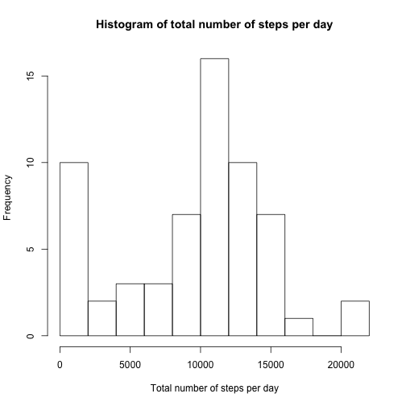
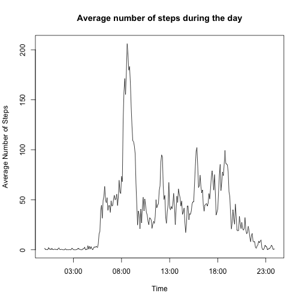
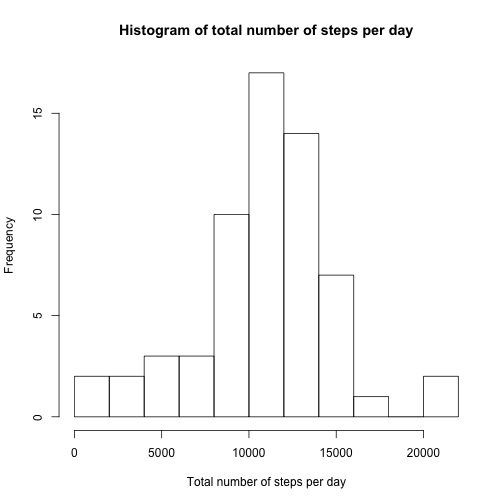
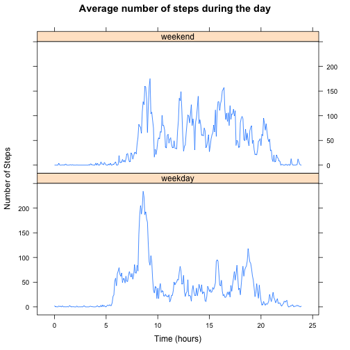

## Loading and preprocessing the data
First we unzip the activity.zip file to access its content. This zip file contains only one file wich is activity.csv,
so we read this file with read.csv function and store it in a data frame named activity and look at its structure.


```r
unzip("./activity.zip")
activity <- read.csv("./activity.csv")
str(activity)
```

```
## 'data.frame':	17568 obs. of  3 variables:
##  $ steps   : int  NA NA NA NA NA NA NA NA NA NA ...
##  $ date    : Factor w/ 61 levels "2012-10-01","2012-10-02",..: 1 1 1 1 1 1 1 1 1 1 ...
##  $ interval: int  0 5 10 15 20 25 30 35 40 45 ...
```

Our activity data fram hase 17568 obs. of  3 variables. Date variable is factor, so we tranform it into Date. Interval
is Integer with its hours multiplied by 100, so we extract it's hours and minutes by dividing on 100 and store its value
in a POSIXct variable named time. It is important to understand that while this variable is helpful for ploting activity
patterns, date in the time variable is today's date, so we also make a POSIXct variable named dateTime which has true
date and time in it.


```r
activity$date <- as.Date(activity$date, format = "%Y-%m-%d", tz = "GMT")
intervalMin <- activity$interval %% 100
intervalHour <- floor(activity$interval / 100)
activity$time <- paste(intervalHour, intervalMin, sep = ":")
activity$time <- as.POSIXct(strptime(activity$time, "%H:%M", tz = "GMT"))
activity$dateTime <- paste(activity$date, intervalHour, intervalMin, sep = " ")
activity$dateTime <- as.POSIXct(strptime(activity$dateTime, format = "%Y-%m-%d %H %M", tz = "GMT"))
str(activity)
```

```
## 'data.frame':	17568 obs. of  5 variables:
##  $ steps   : int  NA NA NA NA NA NA NA NA NA NA ...
##  $ date    : Date, format: "2012-10-01" "2012-10-01" ...
##  $ interval: int  0 5 10 15 20 25 30 35 40 45 ...
##  $ time    : POSIXct, format: "2015-05-18 00:00:00" "2015-05-18 00:05:00" ...
##  $ dateTime: POSIXct, format: "2012-10-01 00:00:00" "2012-10-01 00:05:00" ...
```

Structure of activity data frame is shown above.

## What is mean total number of steps taken per day?
For calculating mean total number of steps per day, we use dplyr package, because its grouping and chain functions will
help us. We will store this measure for every day, in a data frame named daySteps.


```r
library(dplyr)
daySteps <- group_by(activity, date) %>% summarize(totalSteps = sum(steps, na.rm = T))
head(daySteps)
```

```
## Source: local data frame [6 x 2]
## 
##         date totalSteps
## 1 2012-10-01          0
## 2 2012-10-02        126
## 3 2012-10-03      11352
## 4 2012-10-04      12116
## 5 2012-10-05      13294
## 6 2012-10-06      15420
```

We can plot total steps for days easily with hist function. (We made breaks = 10 to make it more meaningful)


```r
hist(daySteps$totalSteps, breaks = 10, xlab = "Total number of steps per day", main = "Histogram of total number of steps per day")
```

 

Calculating mean and median of total number of steps taken per day will be easily done by using mean and median functions.


```r
meanStepsPerDay <- mean(daySteps$totalSteps)
medianStepsPerDay <- median(daySteps$totalSteps)
```

Mean and median of total steps per day are 9354.23 and 10395.

## What is the average daily activity pattern?

With dplyr package, we can group our data based on time of the day and average steps for every group. We store this
information in a data frame named intervalSteps. As this data frame has only two columns, we can pass it to plot function
and plot will recognize x and y as columns 1 and 2, which are time and averageSteps.


```r
intervalSteps <- group_by(activity, time) %>%
    summarize(averageSteps = mean(steps, na.rm = T))
plot(intervalSteps, type = "l", xlab = "Time", ylab = "Average Number of Steps", main = "Average number of steps during the day")
```

 

We can find 5 minute interval with maximum average steps with which.max function.


```r
maxSteps <- intervalSteps[which.max(intervalSteps$averageSteps), 1]
maxSteps <- as.POSIXlt(maxSteps$time)
paste(maxSteps$hour, maxSteps$min, sep = ":")
```

```
## [1] "8:35"
```

As you can see, 8:35 (or 835 interval) has maximum number of steps. Its average steps is 104.

## Imputing missing values

We can calculate the total number of missing values in activity data fram with summing on is.na function. We will use
sapply to calculate this number for every column.


```r
sapply(activity, function(x){sum(is.na(x))})
```

```
##    steps     date interval     time dateTime 
##     2304        0        0        0        0
```

You can see that there are 2304 missing values for steps, and other columns don't have any missing value.
Now we want to impute these missing values. We hypothesize that number of steps is related to intervals and day of the
week, so using lubridate package, we add a wday column to activity data frame. Next we use dplyr to group by wday and
interval and compute the mean for each group and store these data in imputing data frame. This data frame will be used
for imputing the missing values based on interval and day of week for each missing value.


```r
library(lubridate)
activity <- mutate(activity, wday = wday(dateTime))
imputing <- group_by(activity, wday, interval) %>% summarize(mean = mean(steps, na.rm = T))
str(imputing)
```

```
## Classes 'grouped_df', 'tbl_df', 'tbl' and 'data.frame':	2016 obs. of  3 variables:
##  $ wday    : num  1 1 1 1 1 1 1 1 1 1 ...
##  $ interval: int  0 5 10 15 20 25 30 35 40 45 ...
##  $ mean    : num  0 0 0 0 0 ...
##  - attr(*, "vars")=List of 1
##   ..$ : symbol wday
##  - attr(*, "drop")= logi TRUE
```

We copy activiy in another data frame name activityImputed and find the index of missing values in it. We will impute
missing values in this data frame. This will be done using a for loop on index of missing values, with the strategy
described above.


```r
activityImputed <- activity
imputeIndex <- which(is.na(activityImputed$steps))
for(i in imputeIndex){
    activityImputed[i, "steps"] <- imputing[(activityImputed$wday[i] == imputing$wday) & (activityImputed$interval[i] == imputing$interval), 3]
}
str(activityImputed)
```

```
## 'data.frame':	17568 obs. of  6 variables:
##  $ steps   : num  1.43 0 0 0 0 ...
##  $ date    : Date, format: "2012-10-01" "2012-10-01" ...
##  $ interval: int  0 5 10 15 20 25 30 35 40 45 ...
##  $ time    : POSIXct, format: "2015-05-18 00:00:00" "2015-05-18 00:05:00" ...
##  $ dateTime: POSIXct, format: "2012-10-01 00:00:00" "2012-10-01 00:05:00" ...
##  $ wday    : num  2 2 2 2 2 2 2 2 2 2 ...
```

So now we can step 1 of our analysis, but with the imputed values in the data frame. We will create histogram and compute
mean and median of total number of steps per day again.


```r
dayStepsImputed <- group_by(activityImputed, date) %>% summarize(totalSteps = round(sum(steps), digits = 0))
hist(dayStepsImputed$totalSteps, breaks = 10, xlab = "Total number of steps per day", main = "Histogram of total number of steps per day")
```

 

```r
meanStepsPerDayImputed <- mean(dayStepsImputed$totalSteps)
medianStepsPerDayImputed <- median(dayStepsImputed$totalSteps)
```

before imputation, mean and median of total steps per day were 9354.23 and 10395 respectively.
Now these values are 10821.23 and 11015 respectively. So after imputing missing
values, both mean value is now about 1467 steps more and median value is now about 620 steps more, which makes sense.
We can also see that the there was a peek near zero in histogram of step 1, which was due to NA's; but in the new histogram
with imputed values, histogram looks more like a normal distribution  and that peek is gone.

## Are there differences in activity patterns between weekdays and weekends?

We add a factor variable named dayType to activity data frame, with weekday and weekend levels. Using wday variable computed
in last part, we subset rows corresponding to saturday and sunday and make them weekend.


```r
activity$dayType <- factor(rep("weekday", nrow(activity)), levels = c("weekday", "weekend"))
activity$dayType[activity$wday == 7 | activity$wday == 1] <- "weekend"
```

Now using lattice package and with this dayType variable, we can repeat operations of step 2 to create plots for comparing
activity patterns in weekdays and weekends.


```r
library(lattice)
intervalSteps2 <- group_by(activity, time, dayType) %>%
    summarize(averageSteps = mean(steps, na.rm = T))
intervalSteps2$hours <- hour(intervalSteps2$time) + minute(intervalSteps2$time)/60
xyplot(averageSteps ~ hours | dayType, data = intervalSteps2, layout = c(1, 2), type = "l", xlab = "Time (hours)", ylab = "Number of Steps", main = "Average number of steps during the day")
```

 

It is important to note that we created a new variable named hours. That's because we wanted the x axis to be equaly
distributed and reflect the actual measure. So this way 100 would be 1/10 hours more that 50, not twice it!
